# Mobile App - POS Supermarket System

This document provides comprehensive documentation for building a mobile app that connects to your existing POS Supermarket System backend.

## Recommended Tech Stack

```mermaid
graph LR
    A[Mobile App] --> B[Expo React Native]
    B --> C[Supabase Client]
    C --> D[Your Next.js APIs]
    D --> E[Supabase Database]
    
    style A fill:#61dafb
    style B fill:#000
    style C fill:#00ec97
    style D fill:#000
    style E fill:#3ecf8e
```



| Technology | Purpose | Why |
|------------|---------|-----|
| **Expo React Native** | Mobile framework | Shares code with Next.js, fastest development |
| **Supabase JS Client** | Authentication & DB | Already configured in your project |
| **React Navigation** | App navigation | Standard for React Native apps |

## Quick Start Features

Build these features in order for fastest development:

| Priority | Feature | API Endpoints | Estimated Time |
|----------|---------|---------------|----------------|
| 1 | Product Catalog | `/api/customer/products` | 1-2 days |
| 2 | Shopping Cart | `/api/customer/cart` | 2 days |
| 3 | Order Checkout | `/api/customer/checkout` | 2 days |
| 4 | Order History | `/api/customer/orders/[orderId]` | 1 day |
| 5 | Loyalty Dashboard | `/api/loyalty/accounts` | 1 day |
| 6 | Wishlist | `/api/customer/wishlist` | 1 day |
| 7 | User Profile | `/api/auth/profile` | 0.5 day |

---

## API Documentation

### Base URL

```
https://your-domain.com/api
```

All endpoints require authentication via Supabase session token in the Authorization header.

---

## Authentication APIs

### Sign Up Customer

**POST** `/api/auth/customer-sign-up`

Register a new customer account.

**Request Body:**
```json
{
  "fullName": "John Doe",
  "email": "john@example.com",
  "password": "securepassword123",
  "phone": "+256701234567",
  "dateOfBirth": "1990-01-15",
  "gender": "male",
  "address": "123 Main Street",
  "city": "Kampala",
  "country": "Uganda"
}
```

**Response (201):**
```json
{
  "success": true,
  "message": "Account created successfully",
  "userId": "uuid-here"
}
```

**Response (400):**
```json
{
  "error": "Email or phone already registered"
}
```

---

### Sign In

**POST** `/api/auth/signin`

Authenticate user and get session.

**Request Body:**
```json
{
  "email": "john@example.com",
  "password": "securepassword123"
}
```

**Response (200):**
```json
{
  "success": true,
  "user": {
    "id": "uuid-here",
    "email": "john@example.com"
  }
}
```

**Response (401):**
```json
{
  "error": "Invalid credentials"
}
```

---

### Get User Profile

**GET** `/api/auth/profile`

Get current authenticated user's profile.

**Headers:**
```
Authorization: Bearer {session_token}
```

**Response (200):**
```json
{
  "id": "uuid-here",
  "email": "john@example.com",
  "full_name": "John Doe",
  "role": "customer"
}
```

---

### Update User

**POST** `/api/auth/update-user`

Update user profile information.

**Headers:**
```
Authorization: Bearer {session_token}
```

**Request Body:**
```json
{
  "fullName": "John Updated",
  "phone": "+256709876543"
}
```

**Response (200):**
```json
{
  "success": true,
  "message": "Profile updated successfully"
}
```

---

## Customer APIs

### Get Customer Profile

**GET** `/api/customers`

Get customer information.

**Headers:**
```
Authorization: Bearer {session_token}
```

**Response (200):**
```json
{
  "id": "uuid-here",
  "full_name": "John Doe",
  "email": "john@example.com",
  "phone": "+256701234567",
  "membership_tier": "bronze",
  "total_spent": 150000,
  "total_visits": 5
}
```

---

## Product & Catalog APIs

### Get Products

**GET** `/api/customer/products`

Get paginated list of products available for customers.

**Query Parameters:**
| Parameter | Type | Default | Description |
|-----------|------|---------|-------------|
| `page` | number | 1 | Page number |
| `limit` | number | 20 | Items per page |
| `category` | string | - | Filter by category ID |
| `search` | string | - | Search products by name |
| `sortBy` | string | name | Sort field (name, price, created_at) |
| `sortOrder` | string | asc | Sort direction (asc, desc) |

**Example Request:**
```
GET /api/customer/products?page=1&limit=20&search=milk&category=1
```

**Response (200):**
```json
{
  "success": true,
  "products": [
    {
      "id": "uuid-here",
      "name": "Fresh Milk 1L",
      "price": 3500,
      "image_url": "https://...",
      "sku": "MLK-001",
      "stock_quantity": 50,
      "categories": {
        "id": "cat-uuid",
        "name": "Dairy"
      }
    }
  ],
  "categories": [
    {
      "id": "cat-uuid",
      "name": "Dairy"
    }
  ],
  "pagination": {
    "page": 1,
    "limit": 20,
    "total": 100,
    "totalPages": 5
  },
  "filters": {
    "category": "1",
    "search": "milk",
    "sortBy": "name",
    "sortOrder": "asc"
  }
}
```

---

## Cart APIs

### Get Cart

**GET** `/api/customer/cart`

Get current user's shopping cart.

**Headers:**
```
Authorization: Bearer {session_token}
```

**Response (200):**
```json
{
  "items": [
    {
      "id": "cart-item-uuid",
      "product_id": "product-uuid",
      "name": "Fresh Milk 1L",
      "price": 3500,
      "image_url": "https://...",
      "quantity": 2,
      "subtotal": 7000,
      "category": "Dairy"
    }
  ],
  "total": 7000,
  "itemCount": 2
}
```

---

### Add to Cart

**POST** `/api/customer/cart`

Add a product to the shopping cart.

**Headers:**
```
Authorization: Bearer {session_token}
```

**Request Body:**
```json
{
  "productId": "product-uuid",
  "quantity": 2
}
```

**Response (201):**
```json
{
  "success": true,
  "item": {
    "id": "cart-item-uuid",
    "product_id": "product-uuid",
    "quantity": 2
  }
}
```

**Response (400):**
```json
{
  "error": "Insufficient stock"
}
```

---

### Update Cart Item

**PUT** `/api/customer/cart`

Update quantity of an item in cart. Set quantity to 0 to remove.

**Headers:**
```
Authorization: Bearer {session_token}
```

**Request Body:**
```json
{
  "productId": "product-uuid",
  "quantity": 3
}
```

**Response (200):**
```json
{
  "success": true
}
```

---

### Clear Cart

**DELETE** `/api/customer/cart`

Remove all items from cart.

**Headers:**
```
Authorization: Bearer {session_token}
```

**Response (200):**
```json
{
  "success": true
}
```

---

## Order APIs

### Checkout / Place Order

**POST** `/api/customer/checkout`

Create a new order from cart items.

**Headers:**
```
Authorization: Bearer {session_token}
```

**Request Body:**
```json
{
  "shipping_address": "123 Delivery Street, Kampala",
  "payment_method": "mobile_money",
  "order_type": "online",
  "notes": "Please deliver between 9am-5pm"
}
```

**Payment Methods:**
- `cash_on_delivery`
- `card`
- `mobile_money`
- `bank_transfer`

**Response (201):**
```json
{
  "orderId": "order-uuid",
  "invoiceNumber": "ONL-123456-ABCDE",
  "message": "Order placed successfully. Waiting for admin approval."
}
```

**Response (400):**
```json
{
  "error": "Cart is empty"
}
```

---

### Get Order Details

**GET** `/api/customer/orders/[orderId]`

Get detailed information about a specific order.

**Headers:**
```
Authorization: Bearer {session_token}
```

**Example:**
```
GET /api/customer/orders/order-uuid
```

**Response (200):**
```json
{
  "success": true,
  "order": {
    "id": "order-uuid",
    "invoice_number": "ONL-123456-ABCDE",
    "total": 35000,
    "tax_amount": 3000,
    "discount_amount": 0,
    "status": "pending",
    "created_at": "2024-01-15T10:30:00Z",
    "payment_method": "mobile_money",
    "orderSummary": {
      "subtotal": 32000,
      "tax": 3000,
      "discount": 0,
      "total": 35000
    },
    "sale_items": [
      {
        "id": "item-uuid",
        "quantity": 2,
        "unit_price": 3500,
        "line_total": 7000,
        "products": {
          "id": "product-uuid",
          "name": "Fresh Milk 1L",
          "image_url": "https://..."
        }
      }
    ]
  }
}
```

**Order Status Values:**
- `pending` - Awaiting admin approval
- `processing` - Being prepared
- `ready` - Ready for pickup/delivery
- `completed` - Delivered/completed
- `cancelled` - Cancelled

---

## Loyalty APIs

### Get Loyalty Account

**GET** `/api/loyalty/accounts`

Get customer's loyalty account details and recent transactions.

**Headers:**
```
Authorization: Bearer {session_token}
```

**Response (200):**
```json
{
  "customer": {
    "id": "customer-uuid",
    "full_name": "John Doe",
    "email": "john@example.com",
    "phone": "+256701234567",
    "membership_tier": "bronze",
    "total_spent": 150000,
    "total_visits": 5
  },
  "loyaltyAccount": {
    "id": "loyalty-uuid",
    "current_points": 1500,
    "total_points_earned": 2000,
    "total_points_redeemed": 500,
    "tier": "bronze",
    "join_date": "2024-01-01T00:00:00Z",
    "loyalty_program": {
      "name": "Supermarket Rewards",
      "points_per_currency": 0.01,
      "redemption_rate": 0.01
    }
  },
  "recentTransactions": [
    {
      "id": "trans-uuid",
      "points": 150,
      "type": "earn",
      "description": "Purchase reward",
      "created_at": "2024-01-15T10:30:00Z",
      "sale": {
        "invoice_number": "ONL-123456-ABCDE"
      }
    }
  ]
}
```

---

### Create Loyalty Account

**POST** `/api/loyalty/accounts`

Enroll in loyalty program.

**Headers:**
```
Authorization: Bearer {session_token}
```

**Response (201):**
```json
{
  "success": true,
  "loyaltyAccount": {
    "id": "loyalty-uuid",
    "current_points": 0,
    "tier": "bronze"
  }
}
```

**Response (400):**
```json
{
  "error": "Loyalty account already exists"
}
```

---

### Get Loyalty Programs

**GET** `/api/loyalty/programs`

Get available loyalty programs.

**Response (200):**
```json
{
  "programs": [
    {
      "id": "program-uuid",
      "name": "Supermarket Rewards",
      "description": "Earn points on every purchase",
      "points_per_currency": 0.01,
      "currency_to_points_rate": 0.01,
      "redemption_rate": 0.01,
      "minimum_points_for_redemption": 100,
      "is_active": true
    }
  ]
}
```

---

### Get Loyalty Transactions

**GET** `/api/loyalty/accounts/[accountId]/transactions`

Get loyalty transaction history.

**Example:**
```
GET /api/loyalty/accounts/loyalty-uuid/transactions
```

**Response (200):**
```json
{
  "transactions": [
    {
      "id": "trans-uuid",
      "points": 150,
      "type": "earn",
      "description": "Purchase reward",
      "created_at": "2024-01-15T10:30:00Z"
    }
  ]
}
```

---

## Wishlist APIs

### Get Wishlist

**GET** `/api/customer/wishlist`

Get customer's wishlist items.

**Headers:**
```
Authorization: Bearer {session_token}
```

**Response (200):**
```json
{
  "success": true,
  "wishlist": [
    {
      "id": "wishlist-uuid",
      "added_at": "2024-01-15T10:30:00Z",
      "products": {
        "id": "product-uuid",
        "name": "Premium Coffee",
        "price": 15000,
        "sku": "COF-001",
        "image_url": "https://..."
      }
    }
  ]
}
```

---

### Add to Wishlist

**POST** `/api/customer/wishlist`

Add a product to wishlist.

**Headers:**
```
Authorization: Bearer {session_token}
```

**Request Body:**
```json
{
  "productId": "product-uuid"
}
```

**Response (201):**
```json
{
  "success": true,
  "message": "Product added to wishlist",
  "wishlistItem": {
    "id": "wishlist-uuid",
    "product_id": "product-uuid"
  }
}
```

**Response (409):**
```json
{
  "error": "Product already in wishlist",
  "alreadyExists": true
}
```

---

### Remove from Wishlist

**DELETE** `/api/customer/wishlist/[productId]`

Remove a product from wishlist.

**Example:**
```
DELETE /api/customer/wishlist/product-uuid
```

**Headers:**
```
Authorization: Bearer {session_token}
```

**Response (200):**
```json
{
  "success": true,
  "message": "Product removed from wishlist"
}
```

---

## Payment APIs

### Process Payment

**POST** `/api/payments`

Process a payment for an order.

**Headers:**
```
Authorization: Bearer {session_token}
```

**Request Body (Cash):**
```json
{
  "saleId": "order-uuid",
  "paymentMethodId": "pm-uuid",
  "amount": 35000,
  "paymentType": "cash"
}
```

**Request Body (Card):**
```json
{
  "saleId": "order-uuid",
  "paymentMethodId": "pm-uuid",
  "amount": 35000,
  "paymentType": "card",
  "cardData": {
    "number": "4242424242424242",
    "expiryMonth": "12",
    "expiryYear": "2025",
    "holderName": "John Doe"
  }
}
```

**Request Body (Mobile Money):**
```json
{
  "saleId": "order-uuid",
  "paymentMethodId": "pm-uuid",
  "amount": 35000,
  "paymentType": "mobile",
  "phoneNumber": "+256701234567"
}
```

**Response (200):**
```json
{
  "success": true,
  "transactionId": "txn_123456789"
}
```

**Response (400):**
```json
{
  "success": false,
  "error": "Payment declined by card issuer"
}
```

---

## Setup Instructions

### 1. Initialize Expo Project

```bash
npx create-expo-app@latest pos-mobile
cd pos-mobile
npx expo install @supabase/supabase-js @react-navigation/native @react-navigation/stack
```

### 2. Configure Supabase Client

Create `src/lib/supabase.ts`:

```typescript
import { createClient } from '@supabase/supabase-js'

const supabaseUrl = process.env.EXPO_PUBLIC_SUPABASE_URL!
const supabaseAnonKey = process.env.EXPO_PUBLIC_SUPABASE_ANON_KEY!

export const supabase = createClient(supabaseUrl, supabaseAnonKey)
```

Create `.env` file:

```
EXPO_PUBLIC_SUPABASE_URL=https://your-project.supabase.co
EXPO_PUBLIC_SUPABASE_ANON_KEY=your-anon-key
```

### 3. Authentication Helper

Create `src/lib/auth.ts`:

```typescript
import { supabase } from './supabase'

export async function signIn(email: string, password: string) {
  const { data, error } = await supabase.auth.signInWithPassword({
    email,
    password,
  })
  return { data, error }
}

export async function signUp(email: string, password: string, fullName: string) {
  const { data, error } = await supabase.auth.signUp({
    email,
    password,
    options: {
      data: { full_name: fullName },
    },
  })
  return { data, error }
}

export async function signOut() {
  const { error } = await supabase.auth.signOut()
  return { error }
}

export async function getSession() {
  const { data: { session } } = await supabase.auth.getSession()
  return session
}

export async function getUser() {
  const { data: { user } } = await supabase.auth.getUser()
  return user
}
```

### 4. API Client Helper

Create `src/lib/api.ts`:

```typescript
import { supabase } from './supabase'

const API_BASE = 'https://your-domain.com/api'

async function getHeaders() {
  const { data: { session } } = await supabase.auth.getSession()
  return {
    'Content-Type': 'application/json',
    'Authorization': `Bearer ${session?.access_token}`,
  }
}

export async function apiGet(endpoint: string) {
  const response = await fetch(`${API_BASE}${endpoint}`, {
    headers: await getHeaders(),
  })
  return response.json()
}

export async function apiPost(endpoint: string, body: any) {
  const response = await fetch(`${API_BASE}${endpoint}`, {
    method: 'POST',
    headers: await getHeaders(),
    body: JSON.stringify(body),
  })
  return response.json()
}

export async function apiPut(endpoint: string, body: any) {
  const response = await fetch(`${API_BASE}${endpoint}`, {
    method: 'PUT',
    headers: await getHeaders(),
    body: JSON.stringify(body),
  })
  return response.json()
}

export async function apiDelete(endpoint: string) {
  const response = await fetch(`${API_BASE}${endpoint}`, {
    method: 'DELETE',
    headers: await getHeaders(),
  })
  return response.json()
}
```

### 5. Sample Product List Screen

```typescript
// src/screens/ProductsScreen.tsx
import { useState, useEffect } from 'react'
import { FlatList, Text, View, Image, TouchableOpacity, TextInput } from 'react-native'
import { apiGet } from '../lib/api'

export default function ProductsScreen() {
  const [products, setProducts] = useState([])
  const [loading, setLoading] = useState(true)
  const [search, setSearch] = useState('')

  useEffect(() => {
    loadProducts()
  }, [])

  async function loadProducts() {
    setLoading(true)
    const result = await apiGet('/customer/products')
    if (result.success) {
      setProducts(result.products)
    }
    setLoading(false)
  }

  const filteredProducts = products.filter(p => 
    p.name.toLowerCase().includes(search.toLowerCase())
  )

  return (
    <View style={{ flex: 1, padding: 16 }}>
      <TextInput
        style={{ height: 40, borderColor: '#ccc', borderWidth: 1, borderRadius: 8, marginBottom: 16, paddingHorizontal: 12 }}
        placeholder="Search products..."
        value={search}
        onChangeText={setSearch}
      />
      
      <FlatList
        data={filteredProducts}
        keyExtractor={item => item.id}
        renderItem={({ item }) => (
          <TouchableOpacity style={{ flexDirection: 'row', padding: 12, borderBottomWidth: 1, borderColor: '#eee' }}>
            {item.image_url && (
              <Image 
                source={{ uri: item.image_url }} 
                style={{ width: 60, height: 60, borderRadius: 8, marginRight: 12 }}
              />
            )}
            <View style={{ flex: 1 }}>
              <Text style={{ fontSize: 16, fontWeight: 'bold' }}>{item.name}</Text>
              <Text style={{ color: '#666' }}>{item.categories?.name}</Text>
              <Text style={{ fontSize: 14, color: '#007bff' }}>UGX {item.price.toLocaleString()}</Text>
            </View>
          </TouchableOpacity>
        )}
      />
    </View>
  )
}
```

---

## Error Handling

All APIs return errors in this format:

```json
{
  "error": "Error message description"
}
```

**Common HTTP Status Codes:**

| Code | Meaning | Handling |
|------|---------|----------|
| 200 | Success | Show data |
| 201 | Created | Confirm action |
| 400 | Bad Request | Show error to user |
| 401 | Unauthorized | Redirect to login |
| 403 | Forbidden | Show access denied |
| 404 | Not Found | Show not found |
| 500 | Server Error | Show retry message |

---

## Environment Variables

Required in your mobile app `.env` file:

```env
EXPO_PUBLIC_SUPABASE_URL=https://your-project.supabase.co
EXPO_PUBLIC_SUPABASE_ANON_KEY=your-anon-key
EXPO_PUBLIC_API_URL=https://your-domain.com
```

---

## Database Tables Used

The mobile app interacts with these tables:

| Table | Purpose |
|-------|---------|
| `registered_customers` | Customer authentication |
| `customers` | Customer profiles |
| `products` | Product catalog |
| `categories` | Product categories |
| `customer_cart` | Shopping cart |
| `sales` | Orders |
| `sale_items` | Order items |
| `payments` | Payment records |
| `customer_loyalty_accounts` | Loyalty accounts |
| `loyalty_transactions` | Points history |
| `customer_wishlists` | Wishlist items |

---

## Next Steps

1. Set up Expo project with Supabase client
2. Implement authentication flow (login/register)
3. Build product catalog with search/filter
4. Implement shopping cart functionality
5. Create checkout flow with payment
6. Add order history screen
7. Build loyalty dashboard
8. Add wishlist feature
9. Test on iOS and Android

For support, refer to the main project README or open an issue.
