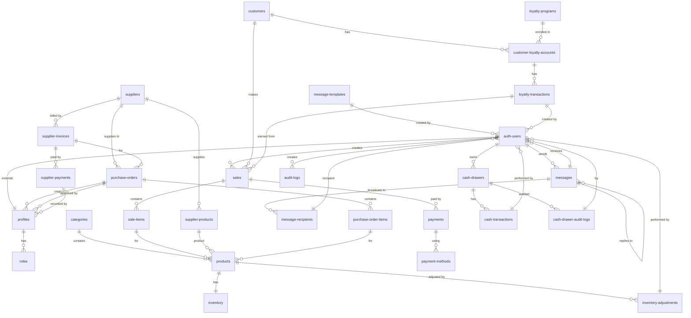

# Entity-Relationship Diagram (ERD)

Below is the Entity-Relationship Diagram for the POS Supermarket System database schema.

## Entity Descriptions

### Core Entities
- **auth.users**: Supabase authentication users
- **profiles**: Extended user profiles with roles
- **roles**: User role definitions (admin, manager, cashier)
- **categories**: Product categories
- **products**: Product catalog with pricing and details
- **inventory**: Stock levels for products
- **inventory_adjustments**: Audit trail for inventory changes

### Sales & Transactions
- **sales**: POS transactions
- **sale_items**: Individual items in a sale
- **payments**: Payment records for sales
- **payment_methods**: Available payment types (cash, card, etc.)
- **customers**: Customer database for CRM

### Communication
- **messages**: Internal messaging system
- **message_recipients**: Recipients for broadcast messages
- **message_templates**: Reusable message templates

### Procurement
- **suppliers**: Supplier information
- **supplier_products**: Products supplied by each supplier
- **purchase_orders**: Purchase orders for inventory
- **purchase_order_items**: Items in purchase orders
- **supplier_invoices**: Invoices from suppliers
- **supplier_payments**: Payments made to suppliers

### Loyalty Program
- **loyalty_programs**: Loyalty program configurations
- **customer_loyalty_accounts**: Customer loyalty accounts
- **loyalty_transactions**: Points earned/redeemed

### Cash Management
- **cash_drawers**: Cash drawer sessions
- **cash_transactions**: Cash movements in/out
- **cash_drawer_audit_logs**: Audit trail for cash operations

### Security & Audit
- **audit_logs**: General system audit logs

## Relationship Types
- `||--||`: One-to-one relationship
- `||--o{`: One-to-many relationship (one to many)
- `}o--||`: Many-to-one relationship (many to one)
- `}o--o{`: Many-to-many relationship

The diagram shows the normalized database structure with proper foreign key relationships and referential integrity.