# System Structure Diagram

Below is a Mermaid diagram illustrating the high-level architecture and structure of the POS Supermarket System.

```mermaid
graph TD
    subgraph Frontend["Frontend (Next.js App)"]
        A[Dashboard]
        B[POS Terminal]
        C[Inventory Management]
        D[Customer Management]
        E[Supplier Management]
        F[Purchase Orders]
        G[Reports & Analytics]
        H[User Management]
        I[Settings]
        J[Profile]
        K[Cash Drawer]
        L[Compliance]
        M[Messages]
        N[Notifications]
    end

    subgraph Components["UI Components"]
        O[POS Components]
        P[Inventory Components]
        Q[Customer Components]
        R[Supplier Components]
        S[Report Components]
        T[User Components]
        U[Settings Components]
        V[Layout Components]
        W[Auth Components]
    end

    subgraph Backend["Backend (API Routes)"]
        X[Auth API]
        Y[Products API]
        Z[Customers API]
        AA[Suppliers API]
        BB[Purchase Orders API]
        CC[Reports API]
        DD[Payments API]
        EE[Inventory API]
        FF[Emails API]
        GG[Cash Drawer API]
        HH[Compliance API]
        II[Biometric API]
    end

    subgraph Services["External Services"]
        JJ[Supabase Auth]
        KK[Supabase Database]
        LL[Resend Email]
        MM[NextAuth]
    end

    subgraph Database["Database (PostgreSQL)"]
        NN[Users Table]
        OO[Products Table]
        PP[Transactions Table]
        QQ[Customers Table]
        RR[Suppliers Table]
        SS[Purchase Orders Table]
        TT[Reports Data]
        UU[Settings Data]
        VV[Audit Logs]
    end

    A --> O
    B --> O
    C --> P
    D --> Q
    E --> R
    F --> S
    G --> S
    H --> T
    I --> U
    J --> V
    K --> V
    L --> W
    M --> V
    N --> V

    O --> X
    P --> Y
    Q --> Z
    R --> AA
    S --> BB
    T --> CC
    U --> DD
    V --> EE
    W --> FF
    V --> GG
    W --> HH
    W --> II

    X --> JJ
    Y --> KK
    Z --> KK
    AA --> KK
    BB --> KK
    CC --> KK
    DD --> KK
    EE --> KK
    FF --> LL
    GG --> KK
    HH --> KK
    II --> JJ

    JJ --> NN
    KK --> OO
    KK --> PP
    KK --> QQ
    KK --> RR
    KK --> SS
    KK --> TT
    KK --> UU
    KK --> VV

    MM --> JJ
```

## Description

- **Frontend**: The user interface built with Next.js and React, organized into dashboard modules for different functionalities.
- **Components**: Reusable UI components using Radix UI and Tailwind CSS.
- **Backend**: API routes handling business logic and data operations.
- **Services**: External integrations like Supabase for backend services, Resend for emails, and NextAuth for authentication.
- **Database**: PostgreSQL tables storing system data.

The arrows represent data flow and dependencies between modules.